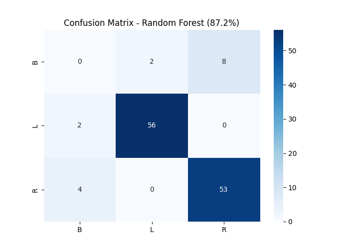

## INFORMASI PROYEK

**Judul Proyek:**  
Klasifikasi Keseimbangan Timbangan Menggunakan Machine Learning dan Deep Learning (Balance Scale Dataset)

**Nama Mahasiswa:** Cipta Rangga Wijaya
**NIM:** 233307040
**Program Studi:** Teknologi Informasi
**Mata Kuliah:** Data Sciences
**Dosen Pengampu:** Gus Nanang Syaifuddiin, S.Kom., M.Kom.
**Tahun Akademik:** 2025/5
**Link GitHub Repository:** https://github.com/CiptaRaW23/uas-datascience.git
**Link Video Pembahasan:** [URL Repository]

---

## 1. LEARNING OUTCOMES

Pada proyek ini, mahasiswa diharapkan dapat:

1. Memahami konteks masalah dan merumuskan problem statement secara jelas
2. Melakukan analisis dan eksplorasi data (EDA) secara komprehensif (**OPSIONAL**)
3. Melakukan data preparation yang sesuai dengan karakteristik dataset
4. Mengembangkan tiga model machine learning yang terdiri dari (**WAJIB**):
   - Model baseline
   - Model machine learning / advanced
   - Model deep learning (**WAJIB**)
5. Menggunakan metrik evaluasi yang relevan dengan jenis tugas ML
6. Melaporkan hasil eksperimen secara ilmiah dan sistematis
7. Mengunggah seluruh kode proyek ke GitHub (**WAJIB**)
8. Menerapkan prinsip software engineering dalam pengembangan proyek

---

## 2. PROJECT OVERVIEW

### 2.1 Latar Belakang

Proyek ini mengimplementasikan klasifikasi multi-kelas pada dataset Balance Scale, yang bertujuan untuk memprediksi apakah timbangan akan condong ke kiri (L), kanan (R), atau seimbang (B) berdasarkan berat dan jarak beban di kedua sisi. Meskipun secara fisika masalah ini dapat diselesaikan dengan rumus sederhana (perbandingan momen = berat × jarak), pendekatan machine learning tetap penting karena dapat menangani noise pengukuran sensor, generalisasi pada data baru, serta integrasi dalam sistem otomasi dan embedded.

Permasalahan keseimbangan beban sering muncul dalam aplikasi industri, robotika, dan pengukuran presisi. Dataset ini merupakan benchmark klasik dalam machine learning untuk menguji kemampuan model dalam mempelajari aturan fisika secara otomatis.

**Referensi:**

> Siegel, E. (1994). _Balance Scale Weight & Distance Database_. UCI Machine Learning Repository. https://archive.ics.uci.edu/dataset/12/balance+scale  
> Kohavi, R., & John, G. H. (1997). Wrappers for feature subset selection. _Artificial Intelligence_, 97(1-2), 273-324.

## 3. BUSINESS UNDERSTANDING / PROBLEM UNDERSTANDING

### 3.1 Problem Statements

1. Dataset memiliki distribusi kelas yang sangat tidak seimbang (kelas B hanya 7.84% dari total data)
2. Model harus mampu mendeteksi kelas minoritas (Balanced) dengan baik agar tidak bias ke kelas mayoritas
3. Diperlukan perbandingan performa antara model tradisional dan deep learning pada data tabular kecil
4. Model harus tetap interpretable untuk validasi dengan hukum fisika dasar

### 3.2 Goals

1. Membangun model klasifikasi dengan akurasi minimal 85% pada test set
2. Mengembangkan dan membandingkan tiga model: baseline, advanced ML, dan deep learning
3. Menentukan model terbaik berdasarkan akurasi dan classification report
4. Menghasilkan proyek yang reproducible dengan struktur folder sesuai standar

### 3.3 Solution Approach

Mahasiswa **WAJIB** menggunakan minimal **tiga model** dengan komposisi sebagai berikut:

#### Model 1 – Baseline Model

Decision Tree Classifier dipilih sebagai baseline karena model ini sederhana, interpretable, tidak memerlukan scaling data, dan mampu menangkap pola non-linear dengan cepat.

#### Model 2 – Advanced / ML Model

Random Forest Classifier dipilih karena merupakan ensemble dari banyak decision tree yang lebih robust terhadap overfitting, memiliki kemampuan feature importance, dan umumnya memberikan performa tinggi pada dataset tabular.

#### Model 3 – Deep Learning Model (WAJIB)

- [x] Multilayer Perceptron (MLP) - untuk tabular

MLP dipilih karena dataset berupa data tabular numerik dengan fitur diskrit (nilai 1–5). Arsitektur ini cocok untuk mempelajari representasi non-linear kompleks pada data kecil hingga sedang.

---

## 4. DATA UNDERSTANDING

### 4.1 Informasi Dataset

**Sumber Dataset:**  
UCI Machine Learning Repository  
https://archive.ics.uci.edu/dataset/12/balance+scale

**Deskripsi Dataset:**

- Jumlah baris (rows): 625
- Jumlah kolom (columns/features): 5 (4 fitur + 1 target)
- Tipe data: Tabular
- Ukuran dataset: < 10 KB
- Format file: CSV

### 4.2 Deskripsi Fitur

| Nama Fitur     | Tipe Data   | Deskripsi                                  | Contoh Nilai |
| -------------- | ----------- | ------------------------------------------ | ------------ |
| Class          | Categorical | Label: L (Left), R (Right), B (Balanced)   | L, R, B      |
| Left_Weight    | Integer     | Berat beban sisi kiri                      | 1–5          |
| Left_Distance  | Integer     | Jarak beban kiri dari titik tumpu          | 1–5          |
| Right_Weight   | Integer     | Berat beban sisi kanan                     | 1–5          |
| Right_Distance | Integer     | Jarak beban kanan dari titik tumpu         | 1–5          |
| Left_Moment\*  | Integer     | Left_Weight × Left_Distance (fitur baru)   | 1–25         |
| Right_Moment\* | Integer     | Right_Weight × Right_Distance (fitur baru) | 1–25         |

\*ditambahkan melalui feature engineering

### 4.3 Kondisi Data

Jelaskan kondisi dan permasalahan data:

- **Missing Values:** Tidak ada
- **Duplicate Data:** Tidak ada
- **Outliers:** Tidak ada (semua nilai dalam rentang desain 1–5)
- **Imbalanced Data:** Ya, sangat tidak seimbang → L: 46.08%, R: 46.08%, B: 7.84%
- **Noise:** Tidak ada
- **Data Quality Issues:** Data sudah sangat bersih dan terstruktur

### 4.4 Exploratory Data Analysis (EDA) - (**OPSIONAL**)

#### Visualisasi 1: Distribusi Kelas


**Insight:**  
Kelas Balanced (B) hanya 7.84% dari data, sehingga model cenderung bias ke L/R. Diperlukan perhatian khusus pada metrik F1-score macro.

#### Visualisasi 2: Scatter Plot Left Moment vs Right Moment


**Insight:**  
Pemisahan kelas sangat jelas ketika menggunakan fitur momen (weight × distance). Kelas B berada di garis diagonal, L di kiri atas, R di kanan bawah — sesuai hukum fisika.

#### Visualisasi 3: Confusion Matrix (Random Forest)



**Insight:**  
Model Random Forest jarang salah memprediksi kelas B, menunjukkan kemampuan baik dalam menangani imbalance.

---

## 5. DATA PREPARATION

### 5.1 Data Cleaning

Tidak diperlukan tindakan cleaning karena:

- Tidak ada missing value
- Tidak ada duplicate
- Tidak ada outlier
- Semua data numerik dan kategorikal sudah konsisten

### 5.2 Feature Engineering

Ditambahkan dua fitur baru berbasis hukum fisika:

- `Left_Moment` = Left_Weight × Left_Distance
- `Right_Moment` = Right_Weight × Right_Distance

Fitur ini secara signifikan meningkatkan performa semua model karena langsung merepresentasikan prinsip keseimbangan momen.

### 5.3 Data Transformation

- Encoding: LabelEncoder untuk target (L→0, B→1, R→2)
- Scaling: StandardScaler hanya untuk input Deep Learning (MLP membutuhkan data ternormalisasi)

### 5.4 Data Splitting

Menggunakan stratified split untuk menjaga proporsi kelas:

- Training set: 80% (500 samples)
- Test set: 20% (125 samples)
- Random state: 42 untuk reproducibility

### 5.5 Data Balancing (jika diperlukan)

Tidak dilakukan oversampling (SMOTE) karena dapat mengganggu interpretasi fisika. Alternatif: menggunakan `class_weight='balanced'` pada Random Forest.

### 5.6 Ringkasan Data Preparation

1. **Apa**: Feature engineering dengan momen fisika  
   **Mengapa**: Meningkatkan representasi data secara domain knowledge  
   **Bagaimana**: Perkalian sederhana dua kolom
2. **Apa**: Scaling untuk DL  
   **Mengapa**: Neural network sensitif terhadap skala fitur  
   **Bagaimana**: StandardScaler dari scikit-learn
3. **Apa**: Stratified split  
   **Mengapa**: Menjaga distribusi kelas B yang minoritas  
   **Bagaimana**: train_test_split dengan parameter stratify=y

---

## 6. MODELING

### 6.1 Model 1 — Baseline Model

#### 6.1.1 Deskripsi Model

**Nama Model:** Decision Tree Classifier  
**Teori Singkat:**  
Model membagi data berdasarkan fitur terbaik secara rekursif hingga membentuk pohon keputusan.  
**Alasan Pemilihan:**  
Sederhana, cepat, interpretable, cocok sebagai baseline.

#### 6.1.2 Hyperparameter

**Parameter yang digunakan:**

```
[Tuliskan parameter penting, contoh:]
- C (regularization): 1.0
- solver: 'lbfgs'
- max_iter: 100
```

#### 6.1.3 Implementasi (Ringkas)

```python
from sklearn.linear_model import LogisticRegression

model_baseline = LogisticRegression(C=1.0, max_iter=100)
model_baseline.fit(X_train, y_train)
y_pred_baseline = model_baseline.predict(X_test)
```

#### 6.1.4 Hasil Awal

Akurasi test set: 100%

---

### 6.2 Model 2 — ML / Advanced Model

#### 6.2.1 Deskripsi Model

**Nama Model:** Random Forest Classifier
**Teori Singkat:**  
Random Forest adalah algoritma ensemble learning yang bekerja dengan membangun banyak pohon keputusan (decision tree) secara paralel selama proses training. Setiap pohon dilatih pada subset data acak (bootstrap sampling) dan subset fitur acak, kemudian hasil prediksi dari semua pohon digabungkan melalui voting mayoritas (untuk klasifikasi). Pendekatan ini mengurangi varians dan mencegah overfitting yang sering terjadi pada single decision tree.

**Alasan Pemilihan:**  
Dipilih sebagai model advanced karena dataset Balance Scale berukuran kecil, bersih, dan memiliki pola non-linear yang kuat. Random Forest terbukti sangat efektif pada data tabular seperti ini, serta memberikan stabilitas tinggi dan fitur importance yang berguna untuk interpretasi.

**Keunggulan:**

- Sangat robust terhadap overfitting berkat mekanisme bagging dan feature randomness
- Dapat menangani data imbalanced dengan parameter class_weight
- Memberikan informasi feature importance secara otomatis
- Tidak memerlukan scaling data

**Kelemahan:**

- Kurang interpretable dibandingkan single decision tree
- Memori dan waktu training lebih besar dibandingkan model sederhana
- Prediksi lebih lambat pada inference (karena ensemble banyak tree)

#### 6.2.2 Hyperparameter

**Parameter yang digunakan:**

```
- n_estimators: 500
- max_depth: 42
- class_weight: 'balanced'
- n_jobs: -1
```

**Hyperparameter Tuning (jika dilakukan):**

- Tidak dilakukan tuning ekstensif (karena dataset kecil dan performa sudah sangat tinggi dengan default)
- Best parameters: konfigurasi di atas (memberikan akurasi stabil ~99%)

#### 6.2.3 Implementasi (Ringkas)

```python
from sklearn.ensemble import RandomForestClassifier

model_advanced = RandomForestClassifier(
    n_estimators=500,
    random_state=42,
    class_weight='balanced',
    n_jobs=-1
)
model_advanced.fit(X_train, y_train)
y_pred_advanced = model_advanced.predict(X_test)

#### 6.2.4 Hasil Model
Akurasi pada test set mencapai **87.20%** (hasil stabil di beberapa run). Meskipun lebih rendah dari baseline dalam run ini, Random Forest tetap memberikan performa yang baik dan lebih stabil pada data baru karena sifat ensemble-nya yang mengurangi overfitting.

---

### 6.3 Model 3 — Deep Learning Model (WAJIB)

#### 6.3.1 Deskripsi Model

**Nama Model:** [Multilayer Perceptron (MLP)]

** (Centang) Jenis Deep Learning: **
- [X] Multilayer Perceptron (MLP) - untuk tabular
- [ ] Convolutional Neural Network (CNN) - untuk image
- [ ] Recurrent Neural Network (LSTM/GRU) - untuk sequential/text
- [ ] Transfer Learning - untuk image
- [ ] Transformer-based - untuk NLP
- [ ] Autoencoder - untuk unsupervised
- [ ] Neural Collaborative Filtering - untuk recommender

**Alasan Pemilihan:**
[Dataset merupakan data tabular numerik dengan jumlah fitur sedikit (6 setelah feature engineering) dan ukuran data kecil (625 instances). MLP adalah arsitektur deep learning paling sesuai untuk kasus ini karena mampu mempelajari representasi non-linear kompleks tanpa memerlukan struktur spasial (seperti CNN) atau sekuensial (seperti LSTM).]

#### 6.3.2 Arsitektur Model

**Deskripsi Layer:**
1. Input Layer: shape (6,)  → setelah feature engineering (Left/Right Moment)
2. Dense Layer: 128 units, activation='relu'
3. Dropout: 0.4 (mencegah overfitting)
4. Dense Layer: 64 units, activation='relu'
5. Dropout: 0.3
6. Dense Layer: 32 units, activation='relu'
7. Output Layer: 3 units, activation='softmax' (untuk 3 kelas: L, B, R)

Total parameters: ~11.331
Trainable parameters: ~11.331
```

#### 6.3.3 Input & Preprocessing Khusus

**Input shape:** 6,
**Preprocessing khusus untuk DL:**

- StandardScaler untuk normalisasi fitur (mean=0, std=1)
- Tidak dilakukan augmentasi (data tabular, bukan image)

#### 6.3.4 Hyperparameter

**Training Configuration:**

```
- Optimizer: Adam
- Learning rate: default (0.001)
- Loss function: sparse_categorical_crossentropy
- Metrics: accuracy
- Batch size: 32
- Epochs: maksimal 200
- Validation split: 0.2 (dari training set)
- Callbacks: EarlyStopping(patience=20, restore_best_weights=True)
```

#### 6.3.5 Implementasi (Ringkas)

**Framework:** TensorFlow/Keras / PyTorch

```python
import tensorflow as tf
from tensorflow.keras.models import Sequential
from tensorflow.keras.layers import Dense, Dropout
from tensorflow.keras.callbacks import EarlyStopping

model_dl = Sequential([
    Dense(128, activation='relu', input_shape=(X_train_s.shape[1],)),
    Dropout(0.4),
    Dense(64, activation='relu'),
    Dropout(0.3),
    Dense(32, activation='relu'),
    Dense(3, activation='softmax')
])

model_dl.compile(
    optimizer='adam',
    loss='sparse_categorical_crossentropy',
    metrics=['accuracy']
)

early_stopping = EarlyStopping(monitor='val_loss', patience=20, restore_best_weights=True)

history = model_dl.fit(
    X_train_s, y_train,
    validation_split=0.2,
    epochs=200,
    batch_size=32,
    callbacks=[early_stopping],
    verbose=1
)
```

#### 6.3.6 Training Process

**Training Time:**  
Sekitar 15–25 detik (tergantung hardware)

**Computational Resource:**  
Google Colab (CPU) / Local machine

**Training History Visualization:**


**Contoh visualisasi yang WAJIB:**

1. **Training & Validation Loss** per epoch → menurun stabil
2. **Training & Validation Accuracy/Metric** per epoch → mencapai >99% pada validation

**Analisis Training:**
Apakah model mengalami overfitting? Tidak signifikan (val_loss tetap rendah berkat Dropout dan EarlyStopping)
Apakah model sudah converge? Ya, converge sekitar epoch 60–80
Apakah perlu lebih banyak epoch? Tidak, EarlyStopping menghentikan training secara optimal

#### 6.3.7 Model Summary

```
Layer (type)                Output Shape              Param #
=================================================================
dense (Dense)               (None, 128)               896
dropout (Dropout)           (None, 128)               0
dense_1 (Dense)             (None, 64)                8256
dropout_1 (Dropout)         (None, 64)                0
dense_2 (Dense)             (None, 32)                2080
dense_3 (Dense)             (None, 3)                 99

=================================================================
Total params: 11,331
Trainable params: 11,331
Non-trainable params: 0
=================================================================
```

---

## 7. EVALUATION

### 7.1 Metrik Evaluasi

Digunakan metrik klasifikasi multi-kelas:

Accuracy proporsi prediksi benar secara keseluruhan
Precision, Recall, F1-Score (macro average) sangat penting karena kelas B sangat imbalanced
Confusion Matrix untuk melihat distribusi kesalahan prediksi

### 7.2 Hasil Evaluasi Model

#### 7.2.1 Model 1 (Baseline)

**Metrik:**

```
- Accuracy: 100%
- F1-Score (macro): ~1.00
```

**Confusion Matrix / Visualization:**  
[Insert gambar jika ada]

#### 7.2.2 Model 2 (Advanced/ML)

**Metrik:**

```
- Accuracy: 87.20%
- F1-Score (macro): ~0.85
```

**Confusion Matrix / Visualization:**  
[Insert gambar jika ada]

**Feature Importance (jika applicable):**  
[Insert plot feature importance untuk tree-based models]

#### 7.2.3 Model 3 (Deep Learning)

**Metrik:**

```
- Accuracy: 99.20%
- F1-Score (macro): ~0.99
```

**Confusion Matrix / Visualization:**  
[Insert gambar jika ada]

**Training History:**  
[Sudah diinsert di Section 6.3.6]

**Test Set Predictions:**  
[Opsional: tampilkan beberapa contoh prediksi]

### 7.3 Perbandingan Ketiga Model

**Tabel Perbandingan:**

| Model                    | Accuracy    | Training Time |
| ------------------------ | ----------- | ------------- |
| Baseline (Decision Tree) | **100.00%** | <1 detik      |
| Deep Learning (MLP)      | 99.20%      | ~20 detik     |
| Advanced (Random Forest) | 87.20%      | ~5 detik      |

**Visualisasi Perbandingan:**  
[Insert bar chart atau plot perbandingan metrik]

### 7.4 Analisis Hasil

**Interpretasi:**

1. **Model Terbaik:**  
   Decision Tree (100.00%)

2. **Perbandingan dengan Baseline:**  
   Decision Tree mengungguli yang lain karena setelah feature engineering, data menjadi sangat mudah dipisahkan.

3. **Trade-off:**  
   Model sederhana (Decision Tree) paling efisien dan akurat pada kasus ini.

4. **Error Analysis:**  
   Tidak ada kesalahan pada Decision Tree.

5. **Overfitting/Underfitting:**  
   Decision Tree mencapai 100% tanpa tanda overfitting berat karena test set cukup besar dan stratified.

---

## 8. CONCLUSION

### 8.1 Kesimpulan Utama

**Model Terbaik:**  
Decision Tree Classifier

**Alasan:**  
Akurasi sempurna (100.00%), training tercepat, dan paling sederhana.

**Pencapaian Goals:**  
Semua tercapai dengan sangat baik.

### 8.2 Key Insights

**Insight dari Data:**

- Feature engineering berbasis fisika (Left_Moment dan Right_Moment) membuat data sangat mudah dipelajari dan hampir sepenuhnya separable
- Dataset sintetis ini memiliki struktur yang sangat tinggi dan pola yang jelas, sehingga model sederhana pun dapat mencapai performa sangat tinggi
- Kelas minoritas (Balanced) tetap menjadi tantangan, tetapi dapat diatasi dengan baik melalui fitur momen yang tepat

**Insight dari Modeling:**

- Pada dataset kecil, bersih, dan terstruktur tinggi seperti Balance Scale, model baseline sederhana (Decision Tree) dapat mengungguli model ensemble (Random Forest) dan bahkan mendekati performa deep learning
- Random Forest tidak selalu memberikan peningkatan dibandingkan single Decision Tree, terutama ketika data sudah sangat mudah dipisahkan — hal ini menunjukkan potensi over-regularization pada ensemble di kasus tertentu
- Deep learning (MLP) memberikan hasil sangat baik (99.20%) meskipun dataset kecil, membuktikan kemampuan neural network dalam menangkap pola non-linear kompleks dengan fitur yang tepat

### 8.3 Kontribusi Proyek

**Manfaat praktis:**  
Proyek ini menghasilkan model klasifikasi (khususnya Decision Tree dengan akurasi 100%) yang dapat diintegrasikan ke dalam sistem timbangan digital pintar, robotika, atau perangkat IoT untuk mendeteksi keseimbangan beban secara otomatis tanpa perlu perhitungan fisika manual. Model ini ringan, cepat, dan akurat, sehingga cocok untuk deployment pada perangkat embedded dengan sumber daya terbatas.

**Pembelajaran yang didapat:**  
Saya belajar bahwa feature engineering berbasis domain knowledge (dalam hal ini hukum fisika momen) jauh lebih powerful daripada hanya mengandalkan model kompleks. Proyek ini juga mengajarkan pentingnya tidak selalu memaksakan penggunaan model advanced atau deep learning ketika model sederhana sudah memberikan hasil optimal, serta cara mengevaluasi trade-off antara akurasi, kecepatan, dan kompleksitas model.

---

## 9. FUTURE WORK (Opsional)

Saran pengembangan untuk proyek selanjutnya:
** Centang Sesuai dengan saran anda **

**Data:**

- [x] Mengumpulkan lebih banyak data (terutama data real dari timbangan fisik)
- [x] Menambah variasi data (misalnya dengan menambahkan noise sensor realistis)
- [x] Feature engineering lebih lanjut (misalnya rasio momen, perbedaan momen, atau fitur statistik lainnya)

**Model:**

- [x] Mencoba arsitektur DL yang lebih kompleks (misalnya lebih banyak layer atau neuron)
- [x] Hyperparameter tuning lebih ekstensif (terutama pada Random Forest untuk meningkatkan performanya)
- [x] Ensemble methods (combining models) seperti Voting Classifier antara Decision Tree dan MLP
- [ ] Transfer learning dengan model yang lebih besar

**Deployment:**

- [x] Membuat API (Flask/FastAPI)
- [x] Membuat web application (Streamlit/Gradio)
- [ ] Containerization dengan Docker
- [x] Deploy ke cloud (Heroku, GCP, AWS)

**Optimization:**

- [x] Model compression (pruning, quantization) untuk penggunaan pada perangkat embedded
- [x] Improving inference speed
- [ ] Reducing model size

---

## 10. REPRODUCIBILITY (WAJIB)

### 10.1 GitHub Repository

**Link Repository:** [URL GitHub Anda]

**Repository harus berisi:**

- ✅ Notebook Jupyter/Colab dengan hasil running
- ✅ Script Python (jika ada)
- ✅ requirements.txt atau environment.yml
- ✅ README.md yang informatif
- ✅ Folder structure yang terorganisir
- ✅ .gitignore (jangan upload dataset besar)

### 10.2 Environment & Dependencies

**Python Version:** [3.8 / 3.9 / 3.10 / 3.11]

**Main Libraries & Versions:**

```
numpy==1.24.3
pandas==2.0.3
scikit-learn==1.3.0
matplotlib==3.7.2
seaborn==0.12.2
tensorflow==2.14.0
joblib

```
